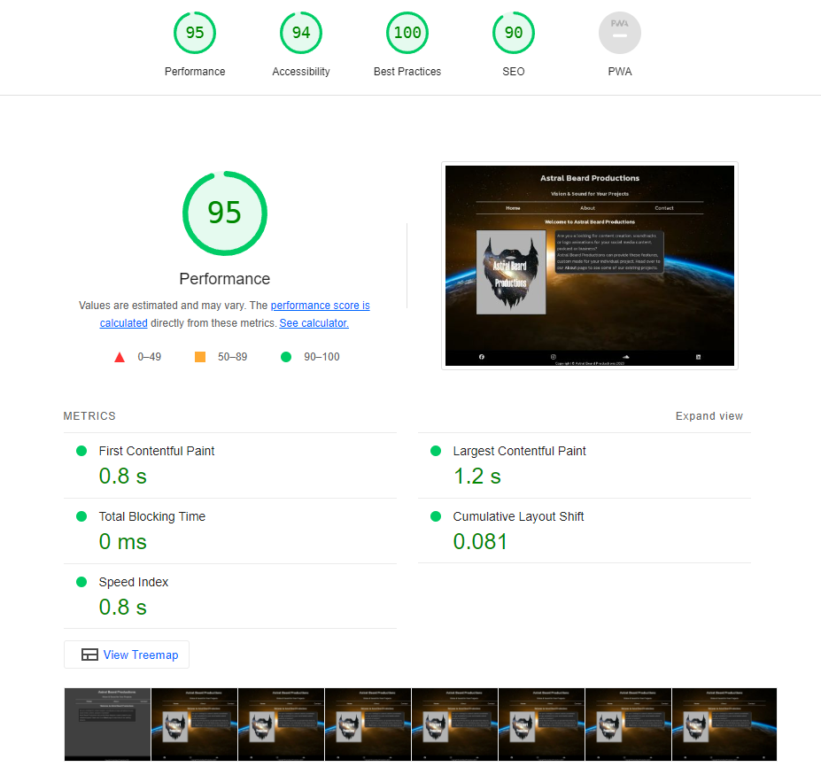
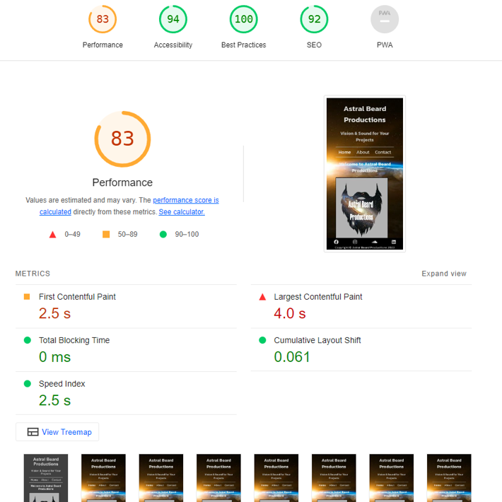

# Astral Beard Production

## Intro

- The purpose of this project is to create a fully functional website that will introduce and showcase a business called Astral Beard Productions (I will use the abbreviation "ABP" from here on in), and allow potential new customers to contact for more information.
- ABP is a production company that provides capture and/or editing of video footage with the addition of a soundtrack composed by ABP themselves. ABP also provides Intro clips and audio for projects like YouTube channels for sports people and for podcasts.

## User Stories

- As a user I was able to quickly identify the purpose of the website and see if it was relevant to needs. The Home page provided me with an introduction to the purpose of the website.
- I was able to navigate the site easily with clearly visible links to move through the website pages. The site has links to other pages within the paragraph text that enabled me to move through the site in a fluid manner.
- Each example project was accompanied with a description of the project and an external link to it's incorporation into a larger project and the people behind the projects.
- I was able to easily find and follow the social media links to see more about the business. This gave me more confidence in the business from seeing a following on social media.

## Features

### Navigation Bar

- Featured on all three pages, the full responsive navigation bar (navbar) includes links to the 'Home', 'About' and 'Contact' pages and is identical in each page to allow for easy navigation.
- This section will allow the user to easily navigate from page to page across all devices without having to revert back to the previous page via the ‘back’ button.
- The current page is highlighted in a brighter font color on the navbar to let the user know which page they are on at that time.
- The navbar page names will also change color when the mouse pointer is hovered over them to indicate that they are functional.

  

### The landing page image

- The landing page image is the ABP logo which shows a galaxy inside of a beard template with the company name imposed over it. There is intro text describing the purpose of the site and a link to the About page in the text. This link is highlighted in a brighter color font and changes color when the mouse pointer hovers over it. This sits over a background image of a sunrise over the planet Earth.

    

- The landing page gives a brief introduction to the function of the website, which is to provide media production options for people looking to create content for YouTube channels, social media, podcasts and websites.

- **About**

- The About page will provide the user with supporting YouTube videos and SoundCloud playlist to showcase previously completed projects.
- This section is valuable to the user as they will be able to easily identify if this service is useful to them.

   

- **Contact**

- This page will allow the user to submit a through a contact form. The user will be required to submit their full name, an email address, and query. They will then be directed to a confirmation page with a link to return to the contact page.

   

- **Confirmation Page**
- The Confirmation page will show a message that the user has successfully completed the contact form. There is also a link back to the Contact page which changes color when hovered over with the mouse pointer.

   

### The Footer

- The footer section includes links to the relevant social media sites for ABP. The links will open to a new tab to allow easy navigation for the user.
- The footer is valuable to the user as it encourages them to keep connected via social media

    

## Future Features

- Future features will include an additional page where original music compositions can be purchased through the website with a copyright.

## Typography and color scheme

- The Kanit font from Google Fonts will be used for this project.
- The color schemes will include Greys #8C8C8C #404040 #262626 #BFBFBF #595959 #d9d9d9 from Adobe Color and black #000000/white /grey contrasts between background and text to give a sleek look over a colored background. I also used #9087b0 for color change on usable links and icons when hovered over with the mouse pointer.

    
    

## Wireframes

   

## Technology Used

### Language Used

- HTML5 and CSS3 were the languages used in this website.

### Programs, Libraries & Frameworks Used

- Google Fonts was used to import the Kanit font used throughout the entire project text.
- Font Awesome was used for all social media icons contained in the project.
- Codeanywhere and VS Code Desktop were used to write the code.
- Inkscape was used for the logo design.
- Favicon.cc was used to generate the favicon.
- Cloudconvert was used to convert my .png to .webp files to increase performance.
- Figma was used to design the wireframe for the project.
- Git was used to commit and push to Github.
- Github was used to store the project code after being pushed.

## Testing

- W3C Markup Validator and W3C CSS Validator were used to validate all three pages of the project. The final tests were completed without errors or warnings.
- Lighthouse developer tool was also used to gauge the performance of the project on desktop and mobile views. The desktop scored a 95, and the mobile test scored 83 for performance.

    
    

### Further Testing

- The project was also tested with Google's dev tools to show responsiveness on different screen sizes, and also on different browsers.
- Testing was done on several desktop and laptop computers, various mobile devices like the iPhone, Nokia, Samsung and Huawei to make sure that the navigation and external links were functioning correctly.
- Family members, friends and colleagues also kindly tested the functionality and user experience at several stages of the projects development.

### Known Bugs

- When scrolling on mobile devices, the background image slightly moves up and down in the scrolling direction. This is happening even though the background image is fixed. The bug persisted with the addition of a @media query to address the issue which has been removed. This bug persists.
- There was an issue with the responsiveness of the About page. I wanted to have the media clip and relevant text on the same row on wider screens, and for the text to move below the media as the screen got narrower. I achieved this by removing the excess html and css that was causing conflicts. This bug on the About page has been resolved.
- I had some issues with the background image not visible after I pushed to Github. The solution to this bug was in the Love Running coursework and I was able to resolve the issue for the final view of the project.
- During the course of the project there were issues with Codeanywhere not loading up my repositary on a few occasions, and also issues with commits not being recognised. I copied my progress to VS Code desktop version and worked from there to have a workspace that I knew would load for me every time, and also see my changes in realtime. I had started to move to Gitpod but encountered conflict issues as can be seen from my git commits. I continued to use Codeanywhere to complete the project.

## Deployment

- The site was deployed to GitHub pages. The steps to deploy are as follows:
- In the GitHub repository, navigate to the Settings tab
- From the source section drop-down menu, select the Master Branch
- Once the master branch has been selected, the page will be automatically refreshed with a detailed ribbon display to indicate the successful deployment.

The live link can be followed here - <https://brianmcconway.github.io/Astral-Beard-Productions/index.html>

## Credits

- How to change color on hover in css 2021 <https://www.youtube.com/watch?v=p2XzQq4vq70> A tutorial on hover css I used for my links changing color when hovered over.
- Pixbay, for the royalty free background image.
- Clipart Library Art, for the outline for the hero image.
- Wallpaper Hub, for the hero image filling.
- Karl McConway, for use of his video footage.
- Geoff Cooper for use of his video footage.
- Sheamus O'Neill, for the use of his club logo.
- All music contained in the website is owned by myself the developer.
- Love Running project, as a template for the comment box, and for the the favicon html.
- This Readme file template, for the suggested layout.

## Acknowledgements

- Friends, family and colleagues, for testing my project at every stage, and also for their feedback.
- My Mentor for constructive feedback and direction.
- Support from The Code Institute.
