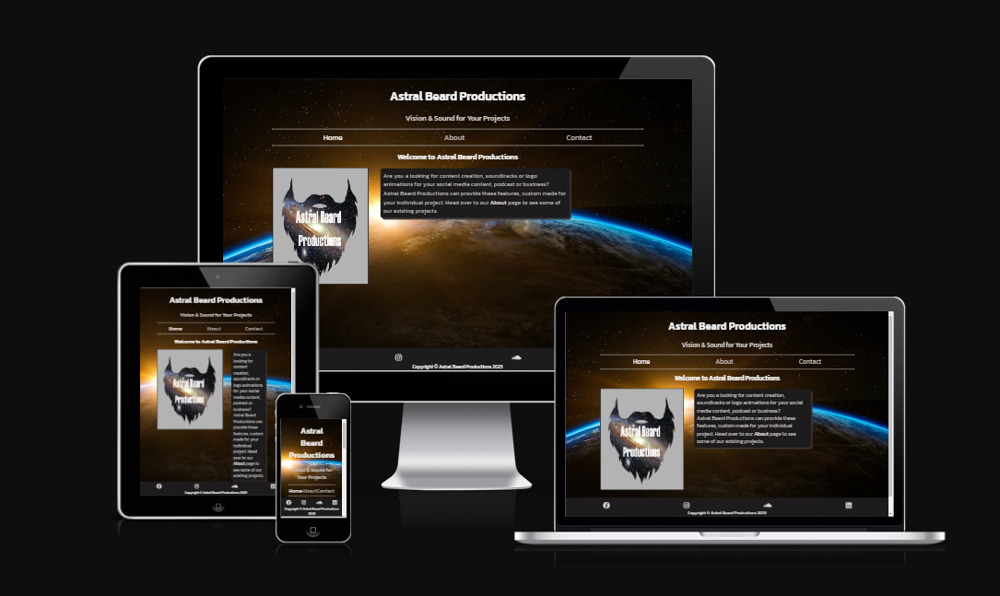

# Astral Beard Production

<!--1. Purpose of the project
1. user stories
2. Features
3. future features
4. Typography and color scheme
5. wireframes
=== 1-6 for planning and then write code ===
1. technology
2. testing
   8.1 code validation
   8.2 test cases (user story based with screenshots)
   8.3 fixed bugs
   8.4 supported screens and browsers
3. Deployment
   9.1 via code anywhere / VS code
   9.2 via github pages
4.  credits-->

## Intro

- The purpose of this project is to create a fully functional website that will introduce and showcase a business called Astral Beard Productions (I will use the abbreviation "ABP" from here on in), and allow potential new customers to contact for more information.
- ABP is a production company that provides capture and/or editing of video footage with the addition of a soundtrack composed by ABP themselves. ABP also provides Intro clips and audio for projects like YouTube channels for sports people and for podcasts.

## User Stories

- As a user I was able to quickly identify the purpose of the website and see if it was relevant to needs. The Home page provided me with an introduction to the purpose of the website.
- I was able to navigate the site easily with clearly visible links to move through the website pages. The site has links to other pages within the paragraph text that enabled me to move through the site in a fluid manner.
- Each example project was accompanied with a description of the project and an external link to it's incorporation into a larger project and the people behind the projects.
- I was able to easily find and follow the social media links to see more about the business. This gave me more confidence in the business from seeing a following on social media.

## Features

- **Navigation Bar**

  - Featured on all three pages, the full responsive navigation bar (navbar) includes links to the 'Home', 'About' and 'Contact' pages and is identical in each page to allow for easy navigation.
  - This section will allow the user to easily navigate from page to page across all devices without having to revert back to the previous page via the ‘back’ button. 
  - The current page is highlighted in a brighter font color on the navbar to let the user know which page they are on at that time. 
  - The navbar page names will also change color when the mouse pointer is hovered over them to indicate that they are functional.
  
    

- **The landing page image**

  - The landing page image is the ABP logo which shows a galaxy inside of a beard template with the company name imposed over it. There is intro text describing the purpose of the site and a link to the About page in the text. This link is highlighted in a brighter color font and changes color when the mouse pointer hovers over it. This sits over a background image of a sunrise over the planet Earth.

      

  - The landing page gives a brief introduction to the function of the website, which is to provide media production options for people looking to create content for YouTube channels, social media, podcasts and websites.

- **The Footer**

  - The footer section includes links to the relevant social media sites for ABP. The links will open to a new tab to allow easy navigation for the user.
  - The footer is valuable to the user as it encourages them to keep connected via social media

    

- **About**

  - The About page will provide the user with supporting YouTube videos and SoundCloud playlist to showcase previously completed projects.
  - This section is valuable to the user as they will be able to easily identify if this service is useful to them.

    

- **Contact**

  - This page will allow the user to submit a through a contact form. The user will be required to submit their full name, an email address, and query. They will then be directed to a confirmation page with a link to return to the contact page.

    

- **Confirmation Page**
- The Confirmation page will show a message that the user has successfully completed the contact form. There is also a link back to the Contact page which changes color when hovered over with the mouse pointer. 
  
    

## Future Features

- Future features will include an additional page where original music compositions can be purchased through the website with a copoyright.
-

## Typography and color scheme

- The Kanit font from Google Fonts will be used for this project.
- The color schemes will include Greys #8C8C8C #404040 #262626 #BFBFBF #595959 #d9d9d9 from Adobe Color and black #000000/white /grey contrasts between background and text to give a sleek look over a colored background. I also used #9087b0 for color change on usable links and icons when hovered over with the mouse pointer.

    
    

## Wireframes

 

## Technology Used

### Language Used

- HTML5 and CSS3 were the languages used in this website.

### Programs, Libraries & Frameworks Used

- Google Fonts was used to import the Kanit font used throughout the entire project text.
- Font Awesome was used for all social media icons contained in the project.
- Codeanywhere and VS Code Desktop were used to write the code.
- Inkscape was used for the logo design.
- Favicon.cc was used to generate the favicon. 
- Cloudconvert was used to convert my .png to .webp files to increase performance.
- Figma was used to design the wireframe for the project.
- Git was used to commit and push to Github.
- Github was used to store the project code after being pushed.
   

## Testing

  - W3C Markup Validator and W3C CSS Validator were used to validate all three page of the project without errors or warnings. 
  - 
<!--In this section, you need to convince the assessor that you have conducted enough testing to legitimately believe that the site works well. Essentially, in this part you will want to go over all of your project’s features and ensure that they all work as intended, with the project providing an easy and straightforward way for the users to achieve their goals.

In addition, you should mention in this section how your project looks and works on different browsers and screen sizes.

You should also mention in this section any interesting bugs or problems you discovered during your testing, even if you haven't addressed them yet.

If this section grows too long, you may want to split it off into a separate file and link to it from here.

### Unfixed Bugs

You will need to mention unfixed bugs and why they were not fixed. This section should include shortcomings of the frameworks or technologies used. Although time can be a big variable to consider, paucity of time and difficulty understanding implementation is not a valid reason to leave bugs unfixed.

## Deployment

This section should describe the process you went through to deploy the project to a hosting platform (e.g. GitHub)

- The site was deployed to GitHub pages. The steps to deploy are as follows:
  - In the GitHub repository, navigate to the Settings tab
  - From the source section drop-down menu, select the Master Branch
  - Once the master branch has been selected, the page will be automatically refreshed with a detailed ribbon display to indicate the successful deployment.

The live link can be found here - <https://code-institute-org.github.io/love-running-2.0/index.html>

## Credits

In this section you need to reference where you got your content, media and extra help from. It is common practice to use code from other repositories and tutorials, however, it is important to be very specific about these sources to avoid plagiarism.

You can break the credits section up into Content and Media, depending on what you have included in your project.

### Content

- The text for the Home page was taken from Wikipedia Article A
- Instructions on how to implement form validation on the Sign Up page was taken from [Specific YouTube Tutorial](https://www.youtube.com/)
- The icons in the footer were taken from [Font Awesome](https://fontawesome.com/)

### Media

- The photos used on the home and sign up page are from This Open Source site
- The images used for the gallery page were taken from this other open source site

Congratulations on completing your Readme, you have made another big stride in the direction of being a developer!

## Other General Project Advice

Below you will find a couple of extra tips that may be helpful when completing your project. Remember that each of these projects will become part of your final portfolio so it’s important to allow enough time to showcase your best work!

- One of the most basic elements of keeping a healthy commit history is with the commit message. When getting started with your project, read through [this article](https://chris.beams.io/posts/git-commit/) by Chris Beams on How to Write  a Git Commit Message
  - Make sure to keep the messages in the imperative mood

- When naming the files in your project directory, make sure to consider meaningful naming of files, point to specific names and sections of content.
  - For example, instead of naming an image used ‘image1.png’ consider naming it ‘landing_page_img.png’. This will ensure that there are clear file paths kept.

- Do some extra research on good and bad coding practices, there are a handful of useful articles to read, consider reviewing the following list when getting started:
  - [Writing Your Best Code](https://learn.shayhowe.com/html-css/writing-your-best-code/)
  - [HTML & CSS Coding Best Practices](https://medium.com/@inceptiondj.info/html-css-coding-best-practice-fadb9870a00f)
  - [Google HTML/CSS Style Guide](https://google.github.io/styleguide/htmlcssguide.html#General)

Getting started with your Portfolio Projects can be daunting, planning your project can make-->
